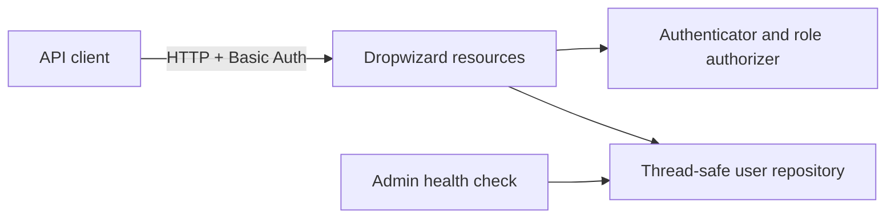

# GameAuth Platform Service

GameAuth is a portfolio reconstruction of my CS 230 operating-platforms work. It turns the original course prototype and design analysis into a small, testable Java service with an explicit security model, a thread-safe repository boundary, and automated quality checks.

## What this demonstrates

- Java 21 and Dropwizard 5 service development
- RESTful CRUD behavior with validation and predictable error responses
- Environment-supplied credentials and role-based authorization
- Thread-safe in-memory persistence with stable identifiers
- Unit, resource, health-check, and end-to-end HTTP testing
- CI verification, formatting enforcement, and coverage thresholds
- Platform analysis and operational support documentation



## Access policy

| Endpoint | USER | ADMIN |
| --- | ---: | ---: |
| `GET /api/status` | Public | Public |
| `GET /api/users/{id}` | Yes | Yes |
| `GET /api/users` | No | Yes |
| `POST /api/users` | No | Yes |
| `PUT /api/users/{id}` | No | Yes |
| `DELETE /api/users/{id}` | No | Yes |

## Run locally

Requirements: Java 21 and Maven 3.9 or later.

1. Set two local-only environment variables:

   ```powershell
   $env:GAMEAUTH_ADMIN_PASSWORD = '<choose-a-local-password>'
   $env:GAMEAUTH_USER_PASSWORD = '<choose-a-different-local-password>'
   ```

2. Build and verify with `mvn verify`.
3. Start with `java -jar target/gameauth-platform-service-1.0.0.jar server config.example.yml`.
4. Check `http://localhost:8080/api/status`. Administrative health checks are at `http://localhost:8081/healthcheck`.

The example configuration contains synthetic `example.invalid` identities and environment placeholders, not usable credentials.

## Security position

HTTP Basic authentication keeps this educational service easy to review, but it is only appropriate on localhost or behind TLS. Passwords are never committed, returned by the API, or written to logs. See [SECURITY.md](SECURITY.md) for the threat boundaries and production recommendations.

## Documentation

- [Architecture](docs/ARCHITECTURE.md)
- [API behavior](docs/API.md)
- [Modernization decisions](docs/MODERNIZATION.md)
- [Platform decision](docs/PLATFORM_DECISION.md)
- [Test strategy](docs/TEST_STRATEGY.md)
- [Support runbook](docs/SUPPORT_RUNBOOK.md)

## Project provenance

The original course submission included design documents, diagrams, archives, generated binaries, and an early Dropwizard prototype. Those artifacts remain available in Git history, but they are intentionally absent from the current branch because they contain personal/course metadata, are difficult to review in GitHub, or are generated outputs. This branch is a new implementation derived from the same learning objectives; it does not claim to be the untouched historical submission.

## Limitations

- Data is intentionally in-memory and resets when the process restarts.
- Basic authentication requires TLS outside local development.
- This repository is a portfolio demonstration, not a production identity provider.
- No license is granted unless a license file is added later.
