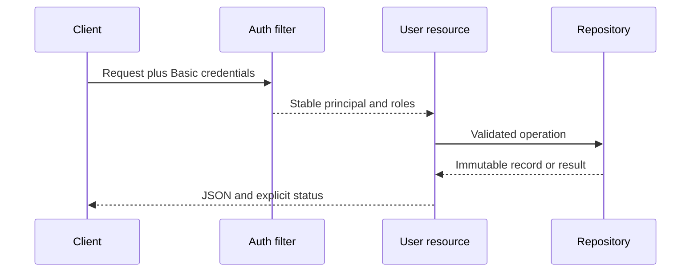

# Architecture

## Context

GameAuth is a single-process REST service that separates HTTP concerns, authentication and authorization, application records, and persistence. The boundary is deliberately small enough to review while showing how a prototype can evolve without coupling resources to storage details.

## Components

- `GameAuthApplication` wires configuration, security, resources, repository, and health checks.
- `ConfiguredAuthenticator` verifies configuration-backed local credentials and returns a stable `GamePrincipal`.
- `RoleAuthorizer` applies endpoint roles through Jakarta security annotations.
- `GameUserResource` owns HTTP status codes, request validation, and safe API errors.
- `GameUserRepository` defines persistence behavior independently of Dropwizard.
- `InMemoryGameUserRepository` uses a concurrent map, atomic identifiers, and synchronized uniqueness checks.
- `UserRepositoryHealthCheck` confirms direct repository access on the administrative connector.

## Data and request flow

Records are immutable Java records. Repository IDs increase monotonically within a process and are never supplied by API clients.

## Evolution path

The `GameUserRepository` interface is the replacement seam for a database-backed implementation. A production design would also move authentication to an external identity provider and deploy behind TLS, without changing the resource contract.
